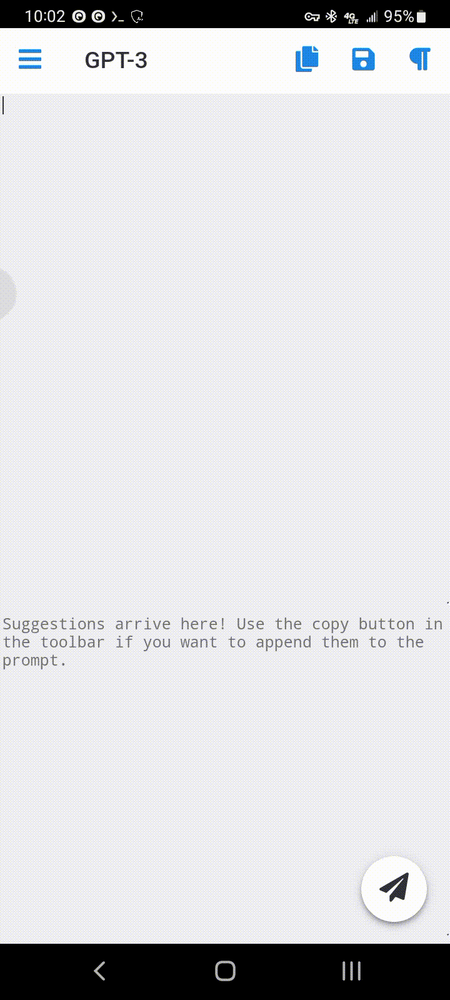

My 'compile-apk-helloworld-in-termux' project was 
used as platform for multiple exploratory attempts 
at making a more complete android app in javascript, 
and finally succeeded with this GPT-3 API project. 

</img>


The APK is available in [releases](https://github.com/rocket-pig/GPT3-Android/releases/tag/final) or compile
yourself with:

Run build from top (this) dir with 
```./build.sh project/```

### Buttons (from left to right)
* Copy up: Copies response from GPT-3 up into the editing field. Good for quickly including response in next prompt.
* Save: Saves contents of top text area to the History screen.
* History: View saved histories. Theres buttons next to each saved blob - to load to main screen or delete.
* If you're using an external keyboard, ALT-ENTER can be used as shortcut to send text instead of clicking the airplane.


### Further Reading
* [GPT-3 Wikipedia](https://en.wikipedia.org/wiki/GPT-3)
* [Get your OpenAI API Key](https://help.openai.com/en/articles/4936850-where-do-i-find-my-secret-api-key)
* [compile-apk-helloworld-in-termux](https://github.com/rocket-pig/compile-apk-helloworld-in-termux)

